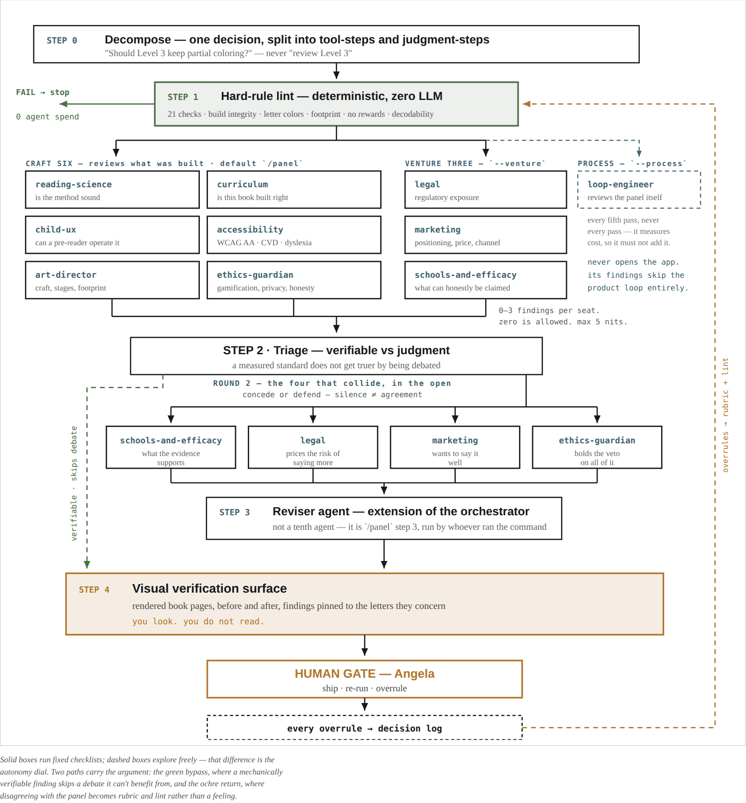
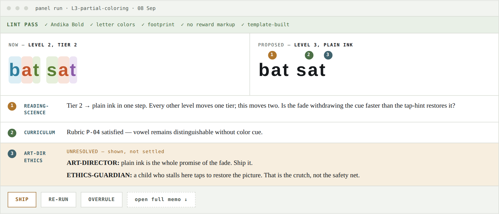
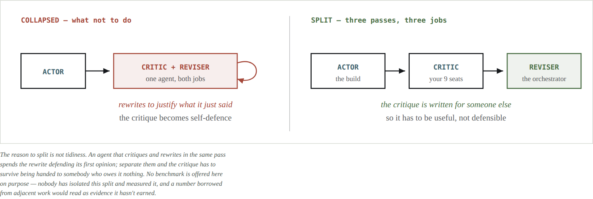
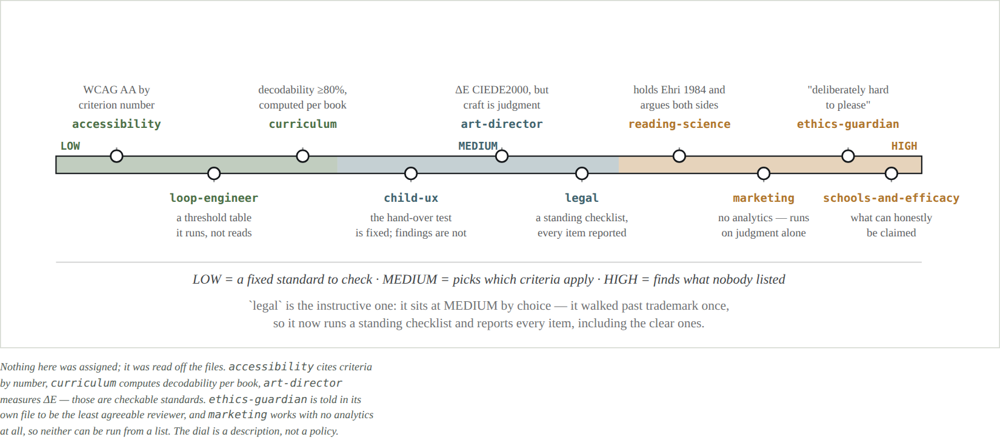
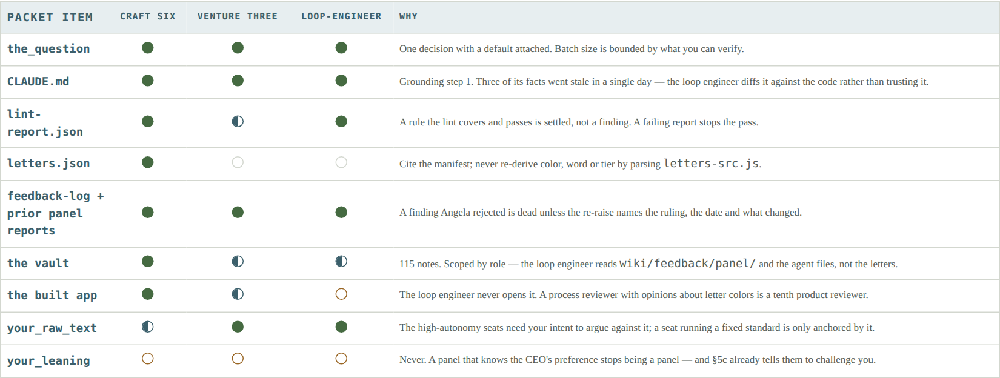
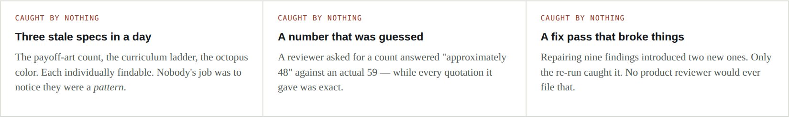
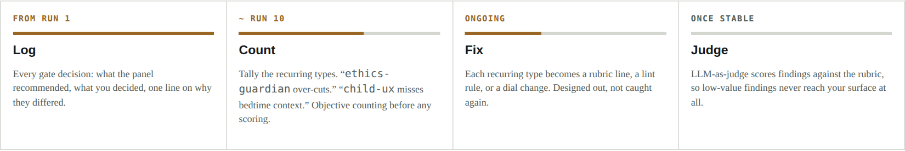
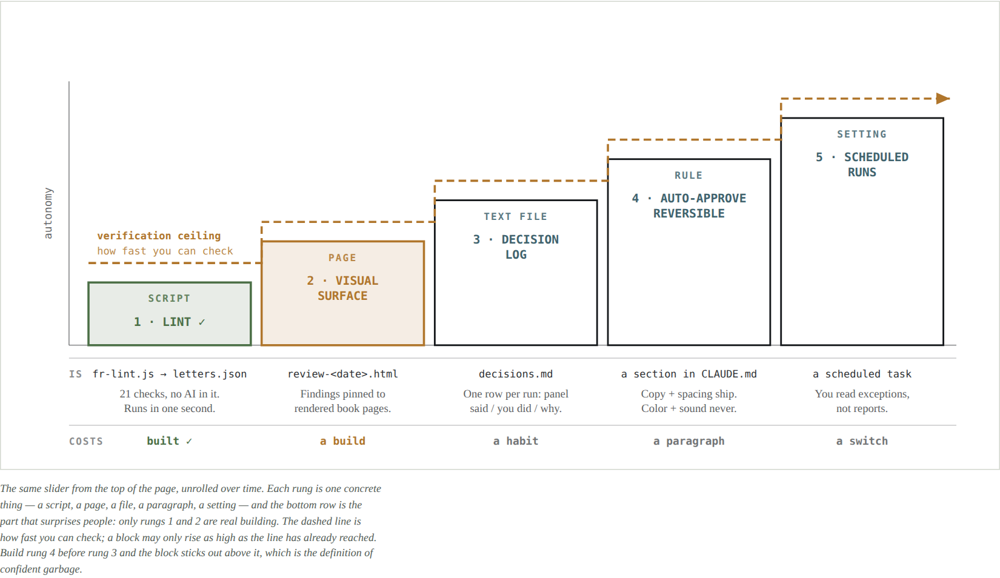

# Loop engineering

**A review panel of ten AI agents, and the machinery that keeps a human able to check it.**

📄 **[The Panel Loop — the whole thing as a designed document (PDF)](the-panel-loop.pdf)** ·
🌐 **[…as a web page](the-panel-loop.html)** ·
🔎 **[Sources — every borrowed claim traced to its sentence (PDF)](sources.pdf)** ·
🧾 **[The agent audit](AGENT-AUDIT.md)**

This is the method as it was actually built and run, for a real product:
[**Fade Readers**](https://github.com/angspos/fade-readers), an early-reading app for children.
Nothing here is hypothetical — the agent files, the linter and the audit are the ones in use.

---

## Why the constraint is you

> **Andrej Karpathy** — the generation–verification loop, the autonomy slider, "keep AI on the leash"
> · [*Software Is Changing (Again)*](https://singjupost.com/andrej-karpathy-software-is-changing-again/), YC AI Startup School, June 2025

> "Usually they are doing the generation, and we as humans are doing the verification. **It is in
> our interest to make this loop go as fast as possible.**"


Autonomy is a slider you may move only as far as your verification reaches. Dragging the handle
past the line doesn't buy speed — it buys **confident garbage**: output that costs more to audit
than it saved. Every build item below exists to push the ochre line rightward.

The corollary that shapes the whole design: **a smarter panel that produces more to read makes
the human slower, not faster.** So the loop is built to reduce what reaches a person, not to
increase what the agents produce.

---

## The loop

> **Cognition** — share full traces, not fragments; conflicting implicit decisions
> · [*Don't Build Multi-Agents*](https://cognition.com/blog/dont-build-multi-agents)

```
STEP 0  Decompose        one decision, phrased as a question with a default answer
STEP 1  Hard-rule lint   deterministic, zero LLM — fails here, no agent spend
ROUND 1 Nine seats       craft six · venture three · (process seat, every 5th pass)
STEP 2  Triage           mechanically verifiable findings skip the debate
ROUND 2 The collisions   the seats whose findings conflict, argued in the open
STEP 3  Reviser          /panel step 3 — the orchestrator, not an agent
STEP 4  Visual surface   rendered pages, findings pinned to what they concern
GATE    The human        ship · re-run · overrule — every overrule logged
```



Solid boxes run fixed checklists; dashed boxes explore freely — **that difference is the autonomy
dial.** Two paths carry the argument: the **green bypass**, where a mechanically verifiable
finding skips a debate it can't benefit from, and the **ochre return**, where disagreeing with the
panel becomes rubric and lint rather than a feeling that has to be re-explained next month.

Step 0 matters more than it looks. The unit is *"Should Level 3 keep partial coloring?"* — never
*"review Level 3"*. One decision, with a default attached, because batch size is bounded by what
you can verify.

Each seat files **0–3 findings. Zero is allowed.** Max 5 nits across the panel.

---

## What you actually look at

> **Andrej Karpathy** — a GUI uses "your computer vision GPU"; reading text is effortful
> · *Software Is Changing (Again)*

This is Step 4, drawn rather than described — because a page arguing for looking shouldn't hand
you six paragraphs. One HTML page per panel run:



*Mockup with example letters and colors — not the real palette. The prose memo still exists, one
click down; it just stops being the first thing you touch.*

**Why this shape.** The green strip means the hard rules held, so you skip straight to judgment.
Findings are *pinned to the letters they concern*, so location is free information. And a live
disagreement renders as **both positions side by side** rather than as the Reviser's summary of
them — you see the argument, not a verdict about the argument.

---

## Actor · Critic · Reviser

> **Andrew Ng** — the Reflection pattern
> · [*Agentic Design Patterns, Part 1*](https://www.deeplearning.ai/the-batch/how-agents-can-improve-llm-performance), The Batch, 20 March 2024
>
> "The LLM examines its own work to come up with ways to improve it."



The reason to split is not tidiness. An agent that critiques and rewrites in the same pass spends
the rewrite **defending its first opinion**; separate them and the critique has to survive being
handed to somebody who owes it nothing.

**No benchmark is offered here on purpose** — nobody has isolated this split and measured it, and
a number borrowed from adjacent work would read as evidence it hasn't earned.

### Where the roles actually live


- **Actor** — the build. Not an agent at all; the template and source files that made the work.
- **Critic** — *all nine seats*, across both rounds. `accessibility` and `curriculum` leave after
  Round 1 because a measured standard doesn't improve by being argued over, not because they were
  ever something other than Critics.
- **Reviser** — **`/panel` step 3, performed by the orchestrator** that launched the panel. It
  holds the role because it critiqued nothing, not because it is a separate entity. Call it *the
  reviser agent — an extension of the orchestrator*. There is no file for it in [`agents/`](agents/).
- The **lint holds no role** — it is a mechanical gate that runs before any of this. And
  `loop-engineer` holds no role in this picture at all: it reviews the picture.

✗ The natural guess is that three of the nine seats *are* the three roles. ✓ In fact one role can
cover nine agents, and the orchestrator can hold one without being an agent.

The rule underneath: **no seat writes the consolidated report.** The moment `ethics-guardian` both
argues to cut the payoff page and writes up what the panel concluded, the write-up becomes a
defence of `ethics-guardian`.

**Known gap, stated plainly:** the consolidation step has never been tested. The nine seats were
interviewed, re-interviewed on their failed gaps, and audited mechanically; step 3 has had none of
that. It is also the step with the worst incentive — the orchestrator that merges is the same one
that chose the question, launched the panel and presents the result. Because it is a role rather
than an agent, **no audit of `agents/` will ever reach it.**
[`loop-engineer`](agents/loop-engineer.md) now owns it.

---

## Autonomy, dialed per seat

> **Andrew Ng** — "there are different degrees to which systems can be agentic"
> · [The Batch, issue 253](https://www.deeplearning.ai/the-batch/issue-253/), 12 June 2024

The dial is not something to bolt on — it is already latent in the agent files. Some seats carry a
fixed standard they check against; some exist to find what nobody wrote down.



| dial | seats | why |
|---|---|---|
| **Low** — a fixed standard to check | `accessibility` (WCAG AA by criterion number) · `curriculum` (decodability ≥80%, computed per book) · `loop-engineer` (a threshold table it runs, not reads) | freedom here buys variance, not insight |
| **Medium** — picks which criteria apply | `art-director` (ΔE CIEDE2000, but craft is judgment) · `child-ux` (the hand-over test is fixed; the findings are not) · `legal` (a standing checklist, every item reported) | |
| **High** — finds what nobody listed | `reading-science` (holds Ehri 1984 and argues both sides) · `ethics-guardian` ("deliberately hard to please") · `marketing` (no analytics — runs on judgment alone) · `schools-and-efficacy` | a checklist would defeat the seat entirely |

**Nothing here was assigned; it was read off the files.** `accessibility` cites criteria by number,
`curriculum` computes decodability per book, `art-director` measures ΔE — those are checkable
standards. `ethics-guardian` is told in its own file to be the least agreeable reviewer, and
`marketing` works with no analytics at all, so neither can be run from a list. **The dial is a
description, not a policy.**

`legal` is the instructive one: it sits at Medium **by choice** — it walked past trademark once
during a re-interview, so it now runs a standing checklist and reports every item, including the
clear ones.

---

## Step 1 — the deterministic gate, before any agent

[`lint/fr-lint.js`](lint/fr-lint.js) — 21 checks, Node, no dependencies, about one second, zero
LLM calls. If it fails, **no agent is ever invoked.**

The strongest check is **build integrity**: it reproduces the shipped build from its sources and
diffs it. On a mismatch it compares mtimes and names which failure it is —

- **STALE** — a source is newer than the build. Rebuild.
- **HAND-EDITED** — nothing is newer, so the build diverged on its own. That is a rule violation.

It found a real one on its first run: a payoff illustration had been nudged 12px so a dog stopped
clipping the page frame, and the build was never regenerated. The clipped version shipped for a
day. No panel of nine reviewers would have caught it; a diff caught it in one second.

The rest: unique letter colors · a 3:1 contrast floor · frame and fade-stage integrity · all 26
letter sounds present · phonetic-only pronunciation with no letter names · no reward or streak
markup anywhere in shipped code · decodability and words-per-page against the level ladder · the
typeface on every child-read selector · frozen reference builds unchanged.

**One design note worth stealing.** The first run threw three false positives: it matched the
*comments asserting the rules* ("no rewards, streaks, or fast motion") and an SVG `points=`
attribute. It now strips comments before the values and phrasing checks. **Rules are checked
against what ships, not against what the comments claim.**

---

## Who gets what

Ten seats, so the packet is scoped **by group** rather than named per agent. Everything below
already lives in [`agents/_PROTOCOL.md`](agents/_PROTOCOL.md) §1, which every reviewer is required
to read first — one file to keep current instead of ten.



`your_leaning` is the row that matters. **Never, by design** — a panel that knows the CEO's
preference stops being a panel, and §5c already tells them to challenge you. `your_raw_text` goes
to the high-autonomy seats, which need your intent in order to argue against it; a seat running a
fixed standard is only anchored by it.

### Build for agents as a third consumer

```jsonc
// letters.json — emitted by fr-lint.js on every run, never hand-written
{ "b": { "word": "bee", "color": "#f8d67c", "cBase": "#b09033",
         "contrastOnCanvas": 3.0, "survivesFade1": false, "font": "Andika-Bold" } }
```

This is what *"build for agents as a third consumer"* means concretely. Humans get a GUI,
computers get an API, and agents get neither — they are machine-speed but read like people. A
reviewer checking whether `b` renders at the right tier shouldn't have to infer it from CSS. And
**a rule the lint covers and passes is settled, not a finding.**

---

## The tenth seat — `loop-engineer`

The nine ask whether the product is any good. This one asks whether **the reviewing** is any good,
and whether it earns its cost. Nothing else was looking at that — and one day's audit made the
case on its own.



- **Three stale specs in a day.** The payoff-art count, the curriculum ladder, the octopus color.
  Each individually findable. Nobody's job was to notice they were a *pattern*.
- **A number that was guessed.** A reviewer asked for a count answered "approximately 48" against
  an actual 59 — while every quotation it gave was exact.
- **A fix pass that broke things.** Repairing nine findings introduced two new ones. Only the
  re-run caught it. No product reviewer would ever file that.

**What it measures — thresholds, not vibes.** Evidence compliance under 90% · a seat filing the
same non-zero count every pass · a Round 1 finding vanishing from Round 2 without an explicit
concede · any spec claim the code contradicts · any number not traceable to a command · a re-raise
missing the required *"rejected on `<date>` because `<reason>`; re-raising because `<what changed>`"*
line · your gate agreement rate · report length against findings that changed a decision · `--all`
run on a single-domain question.

**Two guardrails, and they are the design.**

1. **It never opens the app.** Its inputs are the panel feedback folder, `lint-report.json`, the
   agent files and the decision log. A process reviewer with opinions about letter colors has
   become a tenth *product* reviewer, which is worse than not existing.
2. **It runs every fifth pass, not every pass.** It measures cost; adding cost to every run would
   make it the thing it is checking. Most of its passes should end in "nothing found" — and a
   clean process pass is exactly what tells you the loop is safe to lean on.

And *engineer* is the job, not the permission: it diagnoses the loop and says what to change; it
never changes it itself.

**It carries principles, not people.** Verification bounds autonomy · compute, never estimate ·
decompose before adding autonomy · evals over intuition · read parallelises, writing collides.
Deliberately **unattributed**: a reviewer that invents a position for a living author has done the
exact thing this seat exists to catch.

---

## Evals — the unglamorous version

> **Andrew Ng** — evals and error analysis as the biggest predictor of progress
> · [*Evals and Error Analysis, Part 1*](https://www.deeplearning.ai/the-batch/improve-agentic-performance-with-evals-and-error-analysis-part-1), The Batch, 15 October 2025
>
> The "**single biggest predictor of how rapidly a team makes progress building an AI agent**" is
> its "ability to drive a disciplined process for evals… and error analysis."

It doesn't start as infrastructure. **It starts as a log.**



1. **Log** *(from run 1)* — every gate decision: what the panel recommended, what you decided, one
   line on why they differed.
2. **Count** *(~run 10)* — tally the recurring types. *"`ethics-guardian` over-cuts."*
   *"`child-ux` misses bedtime context."* Objective counting before any scoring.
3. **Fix** *(ongoing)* — each recurring type becomes a rubric line, a lint rule, or a dial change.
   Designed out, not caught again.
4. **Judge** *(once stable)* — LLM-as-judge scores findings against the rubric, so low-value
   findings never reach your surface at all.

**Your agreement rate with the panel is the number that unlocks the ladder below.** Not a feeling
that it's working — a rate you can point at.

---

## The counter-argument this design has to survive

> **Principle 1.** "Share context, and share full agent traces, not just individual messages."
> **Principle 2.** "Actions carry implicit decisions, and conflicting decisions carry bad results."
> — Walden Yan, Cognition, [*Don't Build Multi-Agents*](https://cognition.com/blog/dont-build-multi-agents)

Principle 1 is why Round 2 shares whole traces rather than a summary. Principle 2 is the case
*against* a panel — but their failure cases are agents **writing** in parallel, and
[LangChain draws the same line](https://www.langchain.com/blog/how-and-when-to-build-multi-agent-systems):
read-heavy work parallelises, write-heavy work collides.

Hence the boundary this design holds:

> **The panel reviews in parallel. The build is edited by one thread.**

Nine agents forming opinions about a level is safe. Nine agents editing letter templates is not.

---

## The autonomy ladder

> **Andrej Karpathy** — autonomy moves only as far as verification reaches
> · *Software Is Changing (Again)*



| rung | it **is** | costs | state |
|---|---|---|---|
| 1 · lint | `fr-lint.js` → `letters.json` — 21 checks, no AI in it, runs in one second | a build | **built ✓** |
| 2 · visual surface | `review-<date>.html` — findings pinned to rendered book pages | a build | next |
| 3 · decision log | `decisions.md` — one row per run: panel said / you did / why | a habit | |
| 4 · auto-approve reversible | a section in the spec — copy and spacing ship; color and sound never | a paragraph | |
| 5 · scheduled runs | a setting — you read exceptions, not reports | a switch | |

The same slider from the top of the page, **unrolled over time**. Each rung is one concrete thing —
a script, a page, a file, a paragraph, a setting — and the bottom row is the part that surprises
people: **only rungs 1 and 2 are real building.** The dashed line is how fast you can check; a
block may only rise as high as the line has already reached. Build rung 4 before rung 3 and the
block sticks out above the line, which is the definition of confident garbage.

**Status.** Rung 1 is built — 21 deterministic checks across build integrity, letter rules, sound,
values, decodability and fonts, plus it emits `letters.json` on every run. Its first run caught a
stale build that had shipped for a day. Rebuilt and shipped 2026-09-08. **Rung 2 is next.**

---

## What's here

| path | what it is |
|---|---|
| [`the-panel-loop.pdf`](the-panel-loop.pdf) · [`.html`](the-panel-loop.html) | The full architecture as a designed document. 11 pages. |
| [`sources.pdf`](sources.pdf) · [`sources.html`](sources.html) | Every borrowed claim traced to the sentence it came from. |
| [`AGENT-AUDIT.md`](AGENT-AUDIT.md) | The 2026-09-08 audit of the agents themselves, and the nine-second scan that produced it. |
| [`diagrams/`](diagrams/) | Every diagram above, rendered at 1.5× — reusable on their own. |
| [`agents/`](agents/) | All ten seat definitions plus [`_PROTOCOL.md`](agents/_PROTOCOL.md) — severity scale, evidence standard, grounding order, packet contract. Binding on all ten. |
| [`commands/panel.md`](commands/panel.md) | The `/panel` command: seat groups, round structure, consolidation. |
| [`lint/fr-lint.js`](lint/fr-lint.js) | The rung-1 deterministic gate. 21 checks, no dependencies. |
| [`lint/letters.json`](lint/letters.json) | The manifest it emits — what agents cite instead of parsing source. |
| [`SAFETY.md`](SAFETY.md) | Autonomy tiered by **reversibility** rather than difficulty; everything read is data, not instructions. |
| [`docs/the-panel.md`](docs/the-panel.md) | The panel itself: who each seat is and how they were interviewed. |
| [`docs/design-notes.md`](docs/design-notes.md) | Why each agent is shaped the way it is, including the defects a line-by-line comb caught. |
| [`docs/adapting.md`](docs/adapting.md) | Lifting this to a different product. |

---

## Sources

- Andrej Karpathy — [*Software Is Changing (Again)*](https://singjupost.com/andrej-karpathy-software-is-changing-again/), YC AI Startup School, June 2025
- Andrew Ng — [*Agentic Design Patterns, Part 1*](https://www.deeplearning.ai/the-batch/how-agents-can-improve-llm-performance), The Batch, 20 March 2024
- Andrew Ng — [letter on degrees of agency](https://www.deeplearning.ai/the-batch/issue-253/), The Batch 253, 12 June 2024
- Andrew Ng — [*Evals and Error Analysis, Part 1*](https://www.deeplearning.ai/the-batch/improve-agentic-performance-with-evals-and-error-analysis-part-1), The Batch, 15 October 2025
- Walden Yan, Cognition — [*Don't Build Multi-Agents*](https://cognition.com/blog/dont-build-multi-agents)
- LangChain — [*How and when to build multi-agent systems*](https://www.langchain.com/blog/how-and-when-to-build-multi-agent-systems)

---

## What this is not

The seat roster, the packet contract, the triage split, the ladder, the "confident garbage" phrase
and every Fade Readers rule are **this project's** — argued from the sources above, not endorsed
by them. Where a claim is borrowed, it is quoted and linked. Where this repository goes beyond a
source, it says so.

The panel was built for one product and its examples are all reading-app examples. The
transferable part is the shape: **a deterministic gate before any agent, autonomy dialed per seat
rather than per system, a role split that stops a reviewer from grading itself, an output built
for looking rather than reading, and a seat whose only job is asking whether the loop is still
worth its cost.**

---

## License

Copyright © 2026 Angela Sposato. All rights reserved. Published for reference and portfolio
purposes. See [LICENSE](LICENSE) — the *approach* is offered freely as an idea; reusing the files
themselves is not, so open an Issue and ask.

The product this was built for: **[fade-readers](https://github.com/angspos/fade-readers)** ·
[fadereaders.com](https://fadereaders.com)
