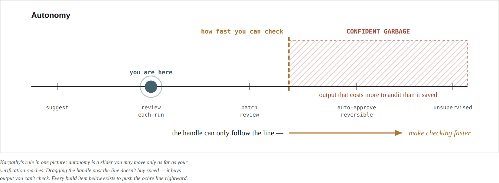
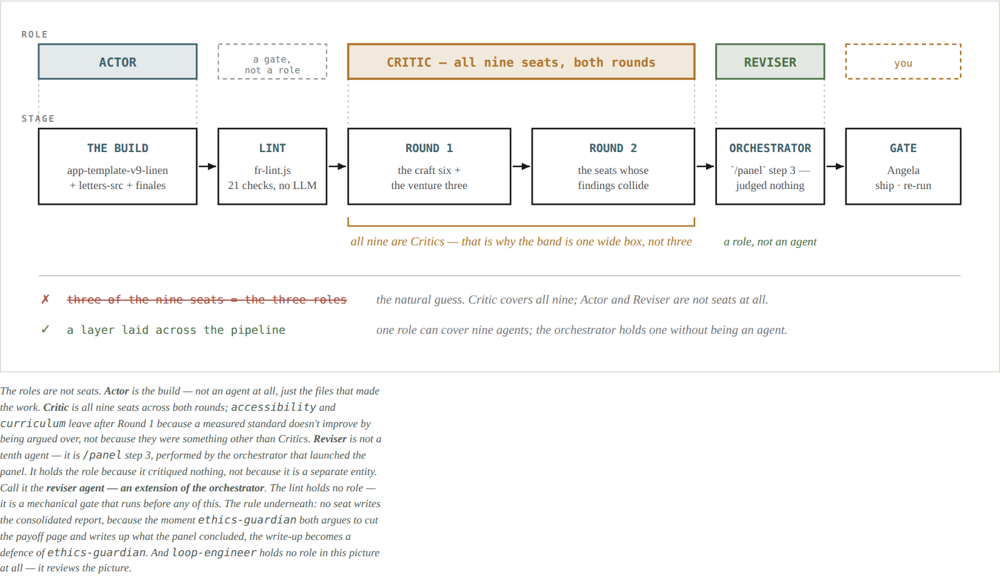

# Loop engineering

**A review panel of ten AI agents, and the machinery that keeps a human able to check it.**

The premise is one sentence, and everything else is a consequence of it:

> "Usually they are doing the generation, and we as humans are doing the verification. **It is in
> our interest to make this loop go as fast as possible.**"
> — Andrej Karpathy, [*Software Is Changing (Again)*](https://singjupost.com/andrej-karpathy-software-is-changing-again/), YC AI Startup School, June 2025

If throughput is set by how fast a person can verify, then a smarter panel that produces more to
read makes you **slower**, not faster. So this design spends its effort on shrinking what reaches
a human — not on making the agents cleverer.



This repository is the method as it was actually built and run, for a real product:
[**Fade Readers**](https://github.com/angspos/fade-readers), an early-reading app for children.
Nothing here is hypothetical — the agent files, the linter, and the audit are the ones in use.

📄 **[The Panel Loop — full architecture, drawn (PDF)](the-panel-loop.pdf)** ·
🔎 **[Sources — every borrowed claim traced to its sentence (PDF)](sources.pdf)** ·
🧾 **[The 2026-09-08 agent audit](AGENT-AUDIT.md)**

---

## The loop

```
STEP 0  Decompose        one decision, phrased as a question with a default answer
STEP 1  Hard-rule lint   deterministic, zero LLM — fails here, no agent spend
ROUND 1 Nine seats       craft six · venture three · (process seat, every 5th pass)
STEP 2  Triage           mechanically verifiable findings skip the debate
ROUND 2 The collisions   the seats whose findings conflict, argued in the open
STEP 3  Reviser          /panel step 3 — the orchestrator, not an agent
STEP 4  Visual surface   rendered pages, findings pinned to what they concern
GATE    The human        ship · re-run · overrule — every overrule logged
```


Two paths carry the argument. The **green bypass**: a mechanically verifiable finding skips a
debate it cannot benefit from — a measured standard does not get truer by being argued over. The
**ochre return**: disagreeing with the panel becomes a rubric line or a lint rule, rather than a
feeling that has to be re-explained next month.

---

## Step 1 — the deterministic gate, before any agent

[`lint/fr-lint.js`](lint/fr-lint.js) — 21 checks, Node, no dependencies, about one second, zero
LLM calls. If it fails, no agent is ever invoked.

The strongest check is **build integrity**: it reproduces the shipped build from its sources and
diffs it. On a mismatch it compares mtimes and names which failure it is —

- **STALE** — a source is newer than the build. Rebuild.
- **HAND-EDITED** — nothing is newer, so the build diverged on its own. That is a rule violation.

It found a real one on its first run: a payoff illustration had been nudged 12px so a dog stopped
clipping the page frame, and the build was never regenerated. The clipped version shipped for a day.
No panel of nine reviewers would have caught it; a diff caught it in a second.

The rest: unique letter colors · a 3:1 contrast floor · frame and fade-stage integrity · all 26
letter sounds present · phonetic-only pronunciation with no letter names · no reward or streak
markup anywhere in shipped code · decodability and words-per-page against the level ladder ·
the typeface on every child-read selector · frozen reference builds unchanged.

It also emits [`lint/letters.json`](lint/letters.json) — a **manifest**. Agents cite the manifest
instead of parsing source, which is both cheaper and harder to get wrong. *A rule the lint covers
and passes is settled, not a finding.*

**One design note worth stealing.** The first run threw three false positives: it matched the
*comments asserting the rules* ("no rewards, streaks, or fast motion") and an SVG `points=`
attribute. It now strips comments before the values and phrasing checks. **Rules are checked
against what ships, not against what the comments claim.**

---

## The role split, and where it actually sits

> **Reflection:** "The LLM examines its own work to come up with ways to improve it."
> — Andrew Ng, [*Agentic Design Patterns, Part 1*](https://www.deeplearning.ai/the-batch/how-agents-can-improve-llm-performance), The Batch, 20 March 2024


- **Actor** — the build. Not an agent at all; the template and source files that made the work.
- **Critic** — *all nine seats*, across both rounds. Not three of them. Two seats drop out after
  Round 1 because a measured standard does not improve by being argued over, not because they
  were ever something else.
- **Reviser** — **`/panel` step 3, performed by the orchestrator.** A role, not an agent. There is
  no file for it in [`agents/`](agents/).

The rule underneath: **no seat writes the consolidated report.** The moment `ethics-guardian` both
argues to cut a page and writes up what the panel concluded, the write-up becomes a defence of
`ethics-guardian`.

**Known gap, stated plainly:** the consolidation step has never been tested. The nine seats were
interviewed, re-interviewed on their failed gaps, and audited mechanically; step 3 has had none of
that. It is also the step with the worst incentive — the orchestrator that merges is the same one
that chose the question, launched the panel and presents the result. Because it is a role rather
than an agent, no audit of `agents/` will ever reach it.
[`loop-engineer`](agents/loop-engineer.md) now owns it.

No benchmark is offered for this split, on purpose: nobody has isolated it and measured it, and a
number borrowed from adjacent work would read as evidence it has not earned.

---

## Autonomy is dialed per seat

> "Rather than arguing over which work to include or exclude as being a true agent, we can
> acknowledge that **there are different degrees to which systems can be agentic**."
> — Andrew Ng, [The Batch, issue 253](https://www.deeplearning.ai/the-batch/issue-253/), 12 June 2024



The dial was not assigned. It was read off the agent files:

| dial | seats | why |
|---|---|---|
| **Low** — a fixed standard to check | `accessibility` (WCAG AA by criterion number) · `curriculum` (decodability ≥80%, computed per book) · `loop-engineer` (a threshold table it runs) | freedom here buys variance, not insight |
| **Medium** — picks which criteria apply | `art-director` (ΔE CIEDE2000, but craft is judgment) · `child-ux` (fixed hand-over test, judgment findings) · `legal` (a standing checklist, every item reported) | |
| **High** — finds what nobody listed | `reading-science` · `ethics-guardian` ("deliberately hard to please") · `marketing` (no analytics — judgment only) · `schools-and-efficacy` | a checklist would defeat the seat entirely |

`legal` is the instructive one. It sits at Medium **by choice**: it walked past trademark once
during a re-interview, so it now runs a standing checklist and reports every item, including the
clear ones.

---

## The tenth seat reviews the loop, never the product

[`agents/loop-engineer.md`](agents/loop-engineer.md) never opens the app. It runs a threshold
table over the panel's own transcripts: evidence compliance, padding signature, silent
capitulation, spec-vs-code drift, estimated numbers, prior-ruling compliance, gate agreement,
verification cost, invocation discipline, grounding freshness, consolidation fidelity.

It runs **every fifth pass, not every pass** — a seat that measures cost must not become the cost.
And *engineer* is the job, not the permission: it diagnoses the loop and says what to change; it
never changes it itself.

It deliberately carries its five principles **unattributed**, so the seat argues from the
principle rather than from a name.

---

## Evals start as a log

> The "**single biggest predictor of how rapidly a team makes progress building an AI agent**" is
> its "ability to drive a disciplined process for evals… and error analysis."
> — Andrew Ng, [*Evals and Error Analysis, Part 1*](https://www.deeplearning.ai/the-batch/improve-agentic-performance-with-evals-and-error-analysis-part-1), The Batch, 15 October 2025

1. **Log** — every gate decision: what the panel recommended, what the human decided, one line on why.
2. **Count** — after ~10 runs, tally the recurring types. Objective counting before any scoring.
3. **Fix** — each recurring type becomes a rubric line, a lint rule, or a dial change.
4. **Judge** — only once the counts stabilise: LLM-as-judge, so low-value findings never surface.

---

## The counter-argument this design has to survive

> **Principle 1.** "Share context, and share full agent traces, not just individual messages."
> **Principle 2.** "Actions carry implicit decisions, and conflicting decisions carry bad results."
> — Walden Yan, Cognition, [*Don't Build Multi-Agents*](https://cognition.com/blog/dont-build-multi-agents)

Principle 1 is why Round 2 shares whole traces rather than a summary. Principle 2 is the case
*against* a panel — but their failure cases are agents **writing** in parallel, and
[LangChain draws the same line](https://www.langchain.com/blog/how-and-when-to-build-multi-agent-systems):
read-heavy work parallelises, write-heavy work collides.

Hence the boundary this design holds:

> **The panel reviews in parallel. The build is edited by one thread.**

Nine agents forming opinions about a level is safe. Nine agents editing letter templates is not.

---

## The autonomy ladder — five rungs, in order


| rung | it is | costs | state |
|---|---|---|---|
| 1 · lint + manifest | `fr-lint.js` → `letters.json` | a build | **done** |
| 2 · visual surface | `review-<date>.html` — findings pinned to rendered pages | a build | next |
| 3 · decision log | `decisions.md` — panel said / you did / why | a habit | |
| 4 · auto-approve reversible | a section in the spec — copy and spacing ship; color and sound never | a paragraph | |
| 5 · scheduled runs | a setting — you read exceptions, not reports | a switch | |

Each rung is only safe because the verification ceiling moved first. **Building rung 4 before rung
3 raises autonomy above what can be checked.** That is the whole discipline, and it is the reason
the ladder is ordered rather than a menu.

---

## What's here

| path | what it is |
|---|---|
| [`the-panel-loop.pdf`](the-panel-loop.pdf) | The full architecture, drawn. 11 pages. |
| [`the-panel-loop.html`](the-panel-loop.html) | The same, as a web page. |
| [`sources.pdf`](sources.pdf) | Every borrowed claim traced to the sentence it came from. |
| [`AGENT-AUDIT.md`](AGENT-AUDIT.md) | The 2026-09-08 audit of the agents themselves, and the method that produced it. |
| [`agents/`](agents/) | All ten seat definitions plus [`_PROTOCOL.md`](agents/_PROTOCOL.md) — severity scale, evidence standard, grounding order, binding on all ten. |
| [`commands/panel.md`](commands/panel.md) | The `/panel` command: seat groups, round structure, consolidation. |
| [`lint/fr-lint.js`](lint/fr-lint.js) | The rung-1 deterministic gate. 21 checks, no dependencies. |
| [`lint/letters.json`](lint/letters.json) | The manifest it emits — what agents cite instead of parsing source. |
| [`SAFETY.md`](SAFETY.md) | The child-safety and honesty rules the panel enforces. |
| [`docs/the-panel.md`](docs/the-panel.md) | The panel itself: who each seat is and how they were interviewed. |
| [`docs/design-notes.md`](docs/design-notes.md) | Why the panel is shaped this way. |
| [`docs/adapting.md`](docs/adapting.md) | How to adapt this to a different product. |

---

## What this is not

The seat roster, the packet contract, the triage split, the ladder and every Fade Readers rule
are **this project's** — argued from the sources above, not endorsed by them. Where a claim is
borrowed, it is quoted and linked. Where this repository goes beyond a source, it says so.

The panel was built for one product and its examples are all reading-app examples. The
transferable part is the shape: **a deterministic gate before any agent, autonomy dialed per seat
rather than per system, a role split that stops a reviewer from grading itself, an output built
for looking rather than reading, and a seat whose only job is asking whether the loop is still
worth its cost.**

---

## License

Copyright © 2026 Angela Sposato. All rights reserved. Published for reference and portfolio
purposes. See [LICENSE](LICENSE).

The product this was built for: **[fade-readers](https://github.com/angspos/fade-readers)** ·
[fadereaders.com](https://fadereaders.com)
